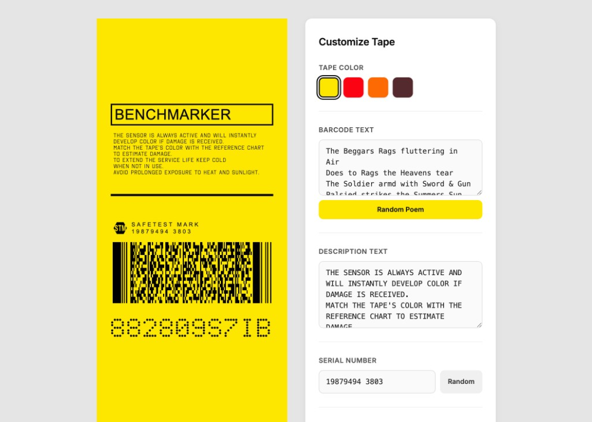

# Damage Sensor Tape

Pages demo: [https://damage-sensor-tape.pages.dev/](https://damage-sensor-tape.pages.dev/)

A web-based generator for the "damage sensor tape" from Death Stranding. The tool renders a live tape preview faithful to the in-game design, with customizable tape color, description text, serial number, LED code, and a PDF417 barcode that encodes random poem excerpts.

Users can tweak every detail through the side control panel and export the final design as PNG, SVG, or PDF. The project runs entirely in the browser with no build step.

Production is deployed on [Cloudflare Pages](https://damage-sensor-tape.pages.dev/) through the repository's native Git integration.

## Related Project

Part of a small series of _Death Stranding_ in-world prop generators:

- **[Do Not Tamper — Custom Sticker Tool](https://do-not-tamper.laammui.workers.dev/)** — an interactive, browser-based generator for the "Do Not Tamper" sticker, with customizable title, serial number, tracking codes, accent color, and holographic gradient theme. Source: [jarvisluk/Do-Not-Temper](https://github.com/jarvisluk/Do-Not-Temper).

## License

The source code is released under the [MIT License](LICENSE). "Death Stranding" and its visual designs are trademarks and/or copyrights of Kojima Productions Co., Ltd. This is an unofficial fan project and is not affiliated with or endorsed by Kojima Productions or Sony Interactive Entertainment.

